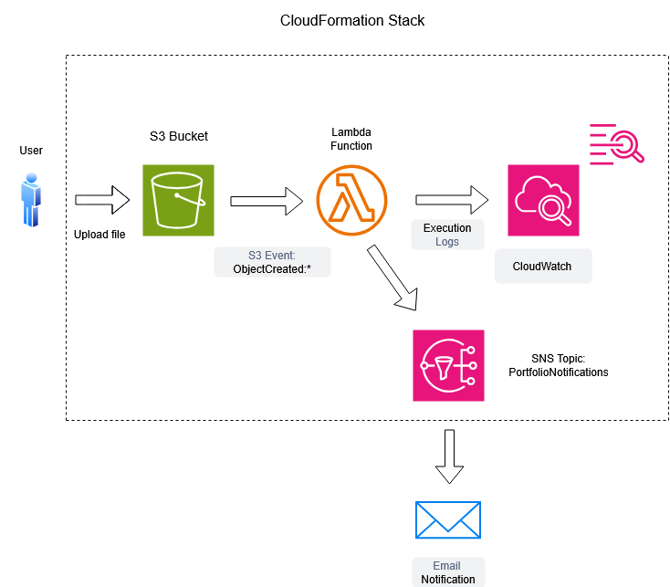

---**AWS Lambda S3 Trigger con SNS**---

- Overview:

Questo laboratorio mostra come creare una funzione AWS Lambda event-driven, che si attiva automaticamente ogni volta che un file viene caricato in un bucket S3.

La Lambda function:

  Legge i metadati del file S3.

  Registra gli eventi in CloudWatch Logs.

  Invia notifiche via SNS per successi e errori.

L’obiettivo è comprendere i flussi event-driven su AWS e configurare correttamente permessi IAM e trigger tra servizi.

- Servizi AWS usati:

 AWS Lambda
 Amazon S3
 Amazon SNS
 IAM
 CloudFormation
 CloudWatch Logs

- Architettura:

1. Un utente carica un file nel bucket S3.
2. L’evento S3 genera una notifica.
3. La notifica invoca la funzione Lambda.
4. La Lambda legge i metadati del file (nome, dimensione), registra l’evento nei log  CloudWatch.
5. La Lambda invia un messaggio a SNS, che inoltra una notifica email con l’esito dell’esecuzione (successo o errore).

- Passaggi di Deployment:

1. Accedere alla console AWS e aprire CloudFormation. 
2. Caricare il file `template.yaml`.  
3. Attendere il completamento dello stack.  
4. Aprire la console SNS e confermare la sottoscrizione al topic PortfolioNotifications
5. Caricare un file nel bucket S3 creato.  
6. Controllare i log su CloudWatch Logs per verificare l’esecuzione della Lambda. 
7. Controllare l'email per la notifica SNS di successo o errore. 

- SNS Notifications:

Il topic SNS PortfolioNotifications riceve messaggi dalla Lambda.

Successo --> email con oggetto: Lambda Execution Success
Errore --> email con oggetto: Lambda Execution Failure 

Il messaggio contiene il nome del file e la sua dimensione, mostrando che la Lambda ha processato correttamente l’evento.

- Diagramma:

- Riassunto:

 Collegato S3 a Lambda tramite notifiche event-driven.
 Configurati permessi IAM.
 Gestite notifiche asincrone tramite SNS.
 Monitoraggio eventi tramite CloudWatch Logs.
 Creazione di un deployment completo attraverso CloudFormation.
